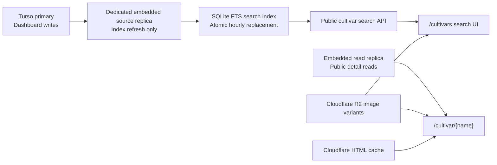

# Public Cultivar Search: Competitive Research and Product Plan

Date: 2026-07-14

## Executive Summary

Daylily Catalog should build an indexable `/cultivars` discovery page backed by
the existing public SQLite/FTS search index, then make the existing
`/cultivar/{cultivar}` pages the canonical center of a connected daylily graph.
The product opportunity is not merely to copy the American Daylily Society's
filter form. It is to combine four things that no reviewed competitor currently
combines well:

1. authoritative registry data across the full cultivar corpus;
2. fast, forgiving search with a modern mobile-first interface;
3. durable connections among cultivars, hybridizers, parentage, images, and
   current catalog availability;
4. useful, indexable entity pages that answer long-tail Google searches.

The closest product analogy is not a normal ecommerce search page. It is the
combination of IMDb's entity pages, Discogs' canonical-record-to-marketplace
model, and MusicBrainz's explicit relationship graph:

- `CultivarReference` is the canonical work or master record.
- A seller's `Listing` is a particular market instance of that record.
- Hybridizers, parents, offspring, awards, images, catalogs, and gardens are
  connected entities or evidence around the record.

The repository is already unusually close to supporting this. The current
development search index contains 104,387 cultivars in an 81 MB SQLite file,
including 71,568 cultivars with an image, 3,941 with a linked public catalog
listing, and 1,159 with a for-sale listing. The production code already builds
the index atomically from a dedicated embedded source replica and can refresh
it hourly without putting per-keystroke traffic on Turso. The correct first
release is therefore a thin, fast search product over this existing system—not
a new service or a second database architecture.

The primary recommendation is:

> Launch `/cultivars` as a fast search and browse surface, improve exact-name
> ranking and result payloads, and simultaneously make every eligible cultivar
> page a useful canonical entity page with crawlable relationship links.

## Scope and Method

This report combines:

- live Chrome review of the two named competitors and their cultivar pages;
- live Google searches for category, head-cultivar, long-tail, site-specific,
  and analogous entity queries;
- review of IMDb, Discogs, and MusicBrainz as adjacent entity-database models;
- current Google Search documentation for sitemaps, faceted navigation,
  images, pagination, and product structured data;
- direct inspection of this checkout's current public search index, cultivar
  pages, sitemap, replica boundary, R2 image model, and Cloudflare cache plan.

Google observations were made on July 14, 2026 in a signed-in Chrome session
from Colorado. Search results are personalized, localized, and volatile, so
the rankings below are directional observations rather than a permanent rank
report. Competitor counts can also move as records are added or corrected.

Primary reviewed pages:

- [American Daylily Society cultivar search](https://daylilies.org/search/)
- [American Daylily Society: Stella de Oro](https://daylilies.org/cultivar/stella-de-oro/)
- [Garden.org daylily group](https://garden.org/plants/group/daylilies/#_search_and_browse)
- [Garden.org advanced daylily search](https://garden.org/plants/group/daylilies/search/)
- [IMDb: Inception](https://www.imdb.com/title/tt1375666/)
- [IMDb search](https://www.imdb.com/find/)
- [Discogs master-release model](https://support.discogs.com/hc/en-us/articles/360005055493-Database-Guidelines-16-Master-Release)
- [MusicBrainz relationships](https://musicbrainz.org/doc/Relationships)

## Market and Search Landscape

### American Daylily Society

The AHS search is the authoritative registry product and the strongest direct
competitor for structured cultivar facts. Its live search reported 104,477
records during this review.

#### What AHS does well

- It has the clearest claim to authoritative registration data.
- Its filter coverage reflects how serious growers actually describe
  daylilies: cultivar name, hybridizer, bloom size and season, scape height,
  form, foliage, color, parentage, ploidy, registration year, fragrance, bud
  count, branching, and detailed flower measurements.
- Results expose a useful density of facts without requiring an immediate
  detail-page visit: image, hybridizer, year, height, bloom size, color,
  rebloom, season, form, fragrance, and awards.
- Search states are shareable. A hybridizer query can be represented in the URL
  and reopened.
- Cultivar pages connect back to the hybridizer and offer a route to other
  cultivars from that hybridizer.
- Exact, obscure cultivar queries perform well in Google. For the corrected
  query `Eblouissant daylily`, the AHS cultivar page appeared first in the live
  review.

#### What AHS does poorly

- Search interaction is slow enough to be conspicuous. Exact and hybridizer
  searches took several seconds in the observed session while controls were
  disabled.
- The interface briefly showed a corpus-wide count while a narrower search was
  still running, which made result state feel contradictory.
- Basic and advanced controls expose a large amount of form chrome before the
  user understands which filters matter. The page offers both automatic search
  behavior and a Search button, creating an unclear interaction contract.
- The global site search and cultivar search compete visually.
- Result links observed in the search UI used `/?p={id}` while the detail page
  declared a cleaner `/cultivar/{slug}/` canonical. That indirection weakens
  the visible information architecture even if canonicalization is technically
  correct.
- The reviewed cultivar detail page had no useful meta description and used
  generic WebPage structured data. Its information is strong, but its search
  presentation is less intentional than the data deserves.
- The product stops near the registry boundary. It does not make current
  catalogs, for-sale availability, multiple garden photographs, comparison,
  personal collections, or a visible parent/offspring graph central.

### Garden.org

Garden.org is the strongest direct competitor for image breadth and community
content. The reviewed group page reported 236,876 images of 106,824 daylilies.

#### What Garden.org does well

- Its image corpus is the clearest competitive asset. The count itself is
  compelling proof of coverage.
- The group landing page gives casual visitors several useful entry points:
  simple search, full browse, recent additions, recent images, care guidance,
  and popular photographs.
- Its records include an extremely broad range of daylily attributes, awards,
  fertility observations, bloom details, and community-contributed material.
- For the obscure `Eblouissant daylily` query, Garden.org appeared directly
  behind AHS in the live Google results.
- Its Google category snippet prominently communicates corpus size and image
  coverage. That is much stronger than a generic “search the database” snippet.

#### What Garden.org does poorly

- The advanced search is a generic plant-database form rather than a focused
  daylily experience. Daylily fields are mixed with long sections for trees,
  shrubs, cacti, fruiting plants, wildlife, and other irrelevant categories.
- The table-like interface is dense, dated, and difficult to scan on a small
  screen.
- It asks users to supply an additional detail beyond cultivar name in the
  advanced form, then directs simple name searches elsewhere. This creates an
  unnecessary division between “simple” and “advanced” search.
- Progressive disclosure is weak: hundreds of controls are available, but the
  product does little to teach which filters are useful for the current query.
- Provenance and confidence are not prominent. A large community database
  benefits from clearly distinguishing registration facts, observations,
  inferred relationships, and contributed content.
- Marketplace and live catalog connections are not the organizing principle.

### Competitive comparison

| Capability                   | AHS                                               | Garden.org               | Daylily Catalog opportunity                               |
| ---------------------------- | ------------------------------------------------- | ------------------------ | --------------------------------------------------------- |
| Registry authority           | Excellent                                         | Broad but mixed-source   | Preserve AHS attribution and freshness visibly            |
| Corpus size                  | About 104k                                        | About 107k               | Full 104,387-record local index today                     |
| Images                       | Useful but inconsistent                           | Exceptional breadth      | 71,568 currently covered; R2 variants make delivery cheap |
| Search speed/clarity         | Powerful, visibly slow                            | Powerful, overloaded     | Instant exact/prefix search with progressive filters      |
| Mobile UX                    | Form-heavy                                        | Very dense               | Phone-first results and filter sheet                      |
| Canonical entity page        | Structured facts                                  | Rich community record    | Facts plus a connected cultivar graph                     |
| Parentage/hybridizer links   | Partial                                           | Broad data               | First-class, crawlable relationships                      |
| Current catalog availability | Not central                                       | Not central              | Native advantage through public seller listings           |
| SEO presentation             | Strong long-tail authority, weak category snippet | Strong count/image proof | Purpose-built metadata, images, sitemaps, internal links  |
| Contribution/community loop  | Institutional                                     | Strong                   | Later: corrections, photos, gardens, collections          |

## What Google Currently Rewards

### Observed direct-competition results

| Query                              | What appeared                                                                                                                                                                                                                           | Product implication                                                                                                                                                                            |
| ---------------------------------- | --------------------------------------------------------------------------------------------------------------------------------------------------------------------------------------------------------------------------------------- | ---------------------------------------------------------------------------------------------------------------------------------------------------------------------------------------------- |
| `daylily database`                 | The legacy `daylilydatabase.org` result appeared first; the new AHS search appeared next with “No information is available for this page”; Garden.org followed with corpus and image counts. Daylily Catalog was not on the first page. | The `/cultivars` landing page needs server-rendered explanatory content, a strong title/description, stable canonical URL, and internal links. A client-only search box is not enough.         |
| `Stella de Oro daylily`            | An AI Overview, commercial sellers, and care sites dominated. Product results showed images, price, stock, and reviews. The major cultivar databases were not visible on the reviewed first page.                                       | Head cultivars have mixed care and purchase intent. Entity pages need excellent images, a concise fact answer, care-context links where defensible, and live offers—not registry data alone.   |
| `Ebleuissant daylily`              | Google corrected the spelling to `Eblouissant`; AHS ranked first and Garden.org second.                                                                                                                                                 | Long-tail exact cultivar discovery is the clearest early SEO wedge. Coverage, spelling tolerance, and useful canonical pages matter more than chasing the largest commercial head terms first. |
| `site:daylilycatalog.com/cultivar` | Existing cultivar pages were indexed, but snippets varied. Some exposed useful specs; others were dominated by seller copy, generic catalog language, or calls to action.                                                               | Metadata and the first visible text need to be cultivar-data-first and deterministic. Seller copy should not become the de facto entity description.                                           |

The July 11 Search Console snapshot previously recorded for this project showed
4,044 discovered sitemap pages. That is a useful historical baseline, not a
current verification. The current sitemap implementation explains the narrow
coverage: it emits cultivar URLs discovered through active public listings
rather than all routable cultivar references.

### IMDb: entity authority and connections

For `Inception movie`, Google surfaced IMDb's 8.8/10 rating in the knowledge
panel alongside other rating sources. IMDb's organic result used a precise
entity title (`Inception (2010)`) and a concise description containing the
director, leading cast, and synopsis.

The [Inception entity page](https://www.imdb.com/title/tt1375666/) demonstrates
the pattern Daylily Catalog should borrow:

- a stable identity and canonical URL;
- an immediate fact summary;
- a strong primary image and extensive image/video media;
- explicit relationships to directors, writers, cast, genres, interests, and
  related works;
- social proof through ratings, reviews, and popularity;
- rich supporting sections such as storyline, FAQ, details, technical specs,
  “more like this,” and user contributions;
- structured data that describes the entity rather than only the web page.

The lesson is not to reproduce IMDb's density in version one. It is that a
search result is an entrance to a durable entity page, and the entity page's
connections create both user exploration and an internal-link graph.

### Discogs: canonical cultivar versus market instances

Discogs is the cleanest model for connecting authoritative identity to a live
market. A [master release groups versions](https://support.discogs.com/hc/en-us/articles/360005055493-Database-Guidelines-16-Master-Release),
while a release page can connect to marketplace inventory, collections, and
wantlists. Google can show both the canonical album concept and particular
versions for sale.

The direct Daylily Catalog translation is:

- cultivar page = master record;
- seller listing = particular market instance;
- catalog offers = marketplace availability;
- garden ownership/list = collection;
- wanted cultivar = wantlist;
- user photographs and corrections = contributions around the canonical
  record.

This is Daylily Catalog's strongest structural advantage over AHS and
Garden.org. The app already owns both sides of this seam.

### MusicBrainz: explicit, sourced relationships

MusicBrainz models typed [relationships among entities](https://musicbrainz.org/doc/Relationships)
and separates a conceptual [release group](https://musicbrainz.org/doc/Release_Group)
from particular releases. Its long-term lesson is to make relationship type and
provenance explicit: parent of, child of, hybridized by, registered by, awarded
by, photographed in, listed by, and sold by.

This does not justify a graph database in version one. SQLite tables or
materialized search-index adjacency tables are sufficient at this scale. The
important product decision is to treat connections as durable data rather than
as one-off “related results” queries.

## Current Repository Readiness

### What already exists

The current architecture is a strong fit for the cheap Hetzner constraint:

- `src/server/search/public-search-index.ts` manages a production-local search
  index, atomic refresh lock, hourly freshness target, and 24-hour maximum
  staleness.
- Production index builds sync a dedicated source replica at
  `/data/search/public-search-source-replica.sqlite`. They do not ask the live
  application replica or remote primary to serve every search.
- `scripts/build-public-search-index.mjs` builds the cultivar and linked-listing
  tables plus an FTS5 index.
- `src/server/search/cultivar-search.ts` already supports name, hybridizer,
  color, parentage, year, height, bloom size, season, habit, form, ploidy,
  foliage, fragrance, bud count, branching, listing text, price, availability,
  and image-related filters.
- `GET /api/v1/cultivars/search` already exposes the search publicly and fails
  with a bounded 503 plus `Retry-After` while an index is unavailable.
- Cultivar detail pages already use public read models that can read from
  `replicaDb`.
- Cultivar image assets already support R2-hosted display and thumbnail
  variants, so search results do not need origin image transformation.
- Public cultivar HTML already fits the Cloudflare-owned cache architecture:
  12 hours fresh, seven days stale-while-revalidate, and one day stale on
  origin error, with RSC/auth/error exclusions owned at the edge.

Current local index inventory:

| Measure                             |  Current value |
| ----------------------------------- | -------------: |
| Cultivar records                    |        104,387 |
| Index file size                     |          81 MB |
| Cultivars with an indexed image     | 71,568 (68.6%) |
| Generated cultivar image records    |          8,453 |
| Cultivars linked to public catalogs |          3,941 |
| Cultivars with a for-sale listing   |          1,159 |
| Registration-year range             |      1762–2027 |

The AHS live count observed during research was 90 records higher than the
current local index. That difference should become a monitored freshness/data
quality signal rather than an assumed error in either source.

### Gaps before this is a public search product

1. **Ranking is not name-first enough.** The FTS query searches display name,
   normalized name, hybridizer, color, and parentage, then orders by unweighted
   `bm25`, listing count, and name. A cultivar whose parentage contains the
   query can compete too closely with an exact cultivar-name match.
2. **Typeahead is not supported cleanly.** Search tokens are quoted exact
   tokens with AND behavior. Prefixes and incomplete final tokens need an
   explicit safe FTS prefix strategy.
3. **The API has no pagination, cursor, total, sort, or facet metadata.** It
   returns at most 50 results.
4. **The result payload is too expensive for every keystroke.** A normal search
   also loads sample listings and opens the separate parentage index to build a
   tree for every result. Those are detail-page concerns, not typeahead
   concerns.
5. **Several advanced text filters are contains scans.** Lowercased
   `%value%` filters over name, hybridizer, color, parentage, and categorical
   fields do not benefit from normal B-tree indexes. The corpus is small enough
   to begin here, but this should be measured rather than assumed cheap under
   bot-shaped concurrency.
6. **`hasPhoto` is semantically surprising.** It currently means a linked
   seller listing has a photo, not that the cultivar reference has an indexed
   image. The product needs separate “cultivar photo” and “listing photo”
   concepts.
7. **The index stores display/original image URLs, not the complete search-card
   asset.** Search results should use the R2 `thumbUrl` plus blur placeholder and
   dimensions where available.
8. **The seller search controller must not be reused as a data architecture.**
   `/{seller}/search` can load a bounded seller catalog into browser state and
   filter it locally. Loading 104k cultivars into the browser would be the wrong
   boundary. Reuse its filter language and visual primitives, not its all-rows
   client snapshot.
9. **The cultivar graph is visibly incomplete.** The current checkout still has
   the related-hybridizer section commented out because its earlier read shape
   fanned out under crawler traffic. Parentage, offspring, hybridizer, and
   related-cultivar relationships should come from bounded indexed queries.
10. **The sitemap only discovers listing-linked cultivars.** A full registry
    cannot fit in one 50,000-URL sitemap. Google documents the 50,000 URL and
    50 MB limits for each sitemap in its [sitemap guidance](https://developers.google.com/search/docs/crawling-indexing/sitemaps/build-sitemap).

## Recommended Product

### Information architecture

#### Version one

- `/cultivars`
  - indexable search and browse landing page;
  - strong server-rendered title, description, corpus count, sample links, and
    explanation even before JavaScript runs;
  - interactive query/filter states in query parameters;
  - filtered/query variants canonicalize to `/cultivars` and are `noindex,
follow` unless intentionally promoted to a curated landing page.
- `/cultivar/{reversible-name-segment}`
  - the existing canonical entity route;
  - available for all valid cultivar references, not only those with seller
    listings;
  - data-first metadata and relationship links.

#### Version two, after search quality is proven

- `/hybridizer/{canonical-segment}`
  - indexable only when it has enough unique value: cultivar count, active
    years, representative cultivars, available photos, and internal links;
  - do not create thin pages for unresolvable or one-off values.
- Cultivar detail sections for parents, registered offspring, other cultivars
  from the hybridizer, current catalog listings, and photograph sources.
- Curated crawlable browse pages such as recently registered, award winners, or
  A–Z. These should be editorially finite—not every possible filter
  permutation.

#### Later

- Compare two to four cultivars.
- Personal collection/garden and wantlist.
- Multiple sourced garden photographs.
- Structured corrections/contributions with provenance and moderation.
- Saved searches and notifications when a wanted cultivar appears in a public
  catalog.

Avoid indexable URLs for every combination of color, form, year, size, season,
and availability. Google's [faceted-navigation guidance](https://developers.google.com/crawling/docs/faceted-navigation)
warns that faceted URLs can create effectively infinite crawl spaces. Query
states should remain useful and shareable for humans while canonical/index
policy stays deliberately small.

### `/cultivars` page design

#### First view

- Headline: “Search over 100,000 registered daylilies.”
- One dominant search field with examples for cultivar and hybridizer names.
- Immediate proof points: total cultivars, image coverage, and live public
  catalogs. Use exact generated counts from index metadata rather than hard-coded
  marketing numbers.
- A useful no-query state: popular available cultivars, recently registered
  cultivars, award winners if data quality supports them, and A–Z browse links.
- Results should never require downloading the corpus into the browser.

#### Search behavior

- Begin suggestions after two meaningful characters.
- Debounce by roughly 200–300 ms and cancel superseded requests.
- Group suggestions by type when relevant: exact cultivars first, then other
  cultivar matches, then hybridizers.
- Rank in this order:
  1. exact normalized cultivar name;
  2. exact display name, including punctuation/spacing normalization;
  3. cultivar-name prefix;
  4. cultivar-name token match;
  5. hybridizer match;
  6. descriptive trait match;
  7. parentage-only match.
- Explain non-name matches with a short label such as “Parentage includes
  Stella de Oro” or “Hybridizer: Carpenter.”
- Offer a spelling suggestion or a normalized alternative when no exact match
  exists.

#### Result card

Each result should contain only the information needed to choose the entity:

- 200 px R2 thumbnail, meaningful alt text, fixed dimensions, and blur
  placeholder;
- cultivar name;
- hybridizer and registration year;
- color plus three or four compact facts, chosen from bloom size, height,
  season, form, ploidy, and foliage;
- “In N catalogs” and “N for sale” when nonzero;
- a small data-source/freshness affordance, not a large disclaimer;
- whole-card canonical link.

Do not embed parentage trees or five seller listings in every result. A single
best availability line or count is enough. The cultivar page is where the full
graph and offers belong.

#### Filters

Start with a small visible set:

- Has cultivar photo
- In public catalogs
- For sale now
- Hybridizer
- Registration year
- Bloom season
- Color

Place the full specialist set behind “More filters”:

- bloom size and scape height ranges;
- form, bloom habit, ploidy, foliage, fragrance, and rebloom;
- bud count and branching;
- parentage;
- listing price and seller-listing text, if those remain part of cultivar
  discovery rather than a separate marketplace search.

Show active filters as removable chips. Sorting should include Relevance, A–Z,
Newest registration, Oldest registration, and Most listed. Do not compute every
possible live facet count on every keystroke in version one; static value lists
and one result count are sufficient.

#### Responsive behavior

- Phone: one-column compact cards, sticky compact search after scrolling, and
  filters in a bottom sheet.
- iPad portrait: search/results remain primary, with a controlled filter panel
  rather than a desktop-width form.
- Desktop: sidebar filters may stay visible, but the page should still read as
  search results, not a database administration form.

### Cultivar entity-page design

Every page should answer “what is this cultivar?” before asking the visitor to
buy, join, or create a catalog.

Recommended page order:

1. Name, primary image, hybridizer, year, concise identity statement.
2. Structured specification grid.
3. Parentage with clickable matched parents and confidence/provenance where
   parsing is imperfect.
4. Registered offspring and other cultivars from the same hybridizer.
5. Multiple sourced photographs when available.
6. Current public catalogs and for-sale listings.
7. Awards and registration/source details.
8. Contribution/correction affordance later.

The page should distinguish authoritative registration facts from community or
seller-contributed information. “Registered data,” “catalog listing,” and
“garden observation” are different evidence types.

## Recommended Technical Architecture

### Search request path

Keep the hot request entirely local to the VPS:

1. Browser requests `/api/v1/cultivars/search`.
2. Route opens the production-local SQLite index.
3. One query returns compact cultivar summaries and `limit + 1` rows.
4. Response includes `nextCursor`, index build timestamp, and optional total.
5. R2 thumbnails load directly through Cloudflare.
6. No Prisma, remote Turso, parentage-tree expansion, or per-result database
   request occurs on the typeahead path.

Use the embedded read replica for detail-page origin renders and for deliberate
index/source refreshes. Keep the live Turso primary for dashboard/user-owned
writes. This preserves the project's existing ownership boundary.

### API changes

Extend the existing v1 endpoint additively rather than adding another internal
search stack:

- `mode=summary|full`, defaulting to summary for public UI use;
- `cursor` and `sort`;
- `limit`, still bounded;
- `include=availabilitySample` only when a caller needs a listing preview;
- response metadata: `nextCursor`, `hasMore`, `indexBuiltAt`, normalized query,
  and optionally `total`;
- explicit `hasCultivarPhoto` and `hasListingPhoto` filters;
- compact `imageAsset` with `thumbUrl`, `blurUrl`, width, and height when known;
- a `matchedOn`/match-reason field.

For alphabetical browsing, use a stable `(displayName, id)` keyset cursor. For
relevance ordering, encode rank/name/id plus the index build version; if an
atomic index refresh changes the build version, reset the cursor rather than
mixing two result orders. Page/offset can be an acceptable first release for a
bounded number of relevance pages, but deep A–Z browse should be keyset-based.

### Index changes

- Add explicit exact and normalized-name ranking boosts.
- Weight FTS columns so name outranks hybridizer, which outranks descriptive
  traits, which outrank parentage.
- Add safe prefix matching for the final token.
- Materialize the R2 thumbnail/blur fields needed by search cards.
- Separate cultivar-image availability from seller-listing-image availability.
- Consider indexed normalized categorical columns instead of repeated
  `lower(column) LIKE '%value%'` for fixed filters.
- Materialize bounded relationship adjacency for parent, offspring, and
  hybridizer connections. A graph database is not required.
- Store compact facet dictionaries and current index counts in metadata so the
  landing page can state coverage without an extra full-table query.

Before optimizing further, benchmark representative query classes against the
production-shaped index with concurrency:

- exact name;
- two-character prefix;
- hybridizer;
- common color/season combination;
- no-query A–Z;
- a broad parentage term;
- image plus for-sale filters.

The success target should be measured at the API boundary, including connection
and JSON work, not only with direct SQLite timing.

### Cloudflare and caching

- Keep `/cultivars` search interactions dynamic. The page's explanatory shell
  may be static or edge-cached, but query JSON must not enter the public HTML
  cache rule.
- Keep `/cultivar/*` in the existing Cloudflare HTML cache design and extend
  the positive route matcher carefully for any new indexable hybridizer pages.
- Retain the status-code guard so 404/5xx responses never inherit the success
  TTL.
- If repeated anonymous search queries warrant caching, use a short edge TTL
  for normalized GET query URLs only after verifying the full query is in the
  cache key. Start without this; an 81 MB local SQLite index should be allowed
  to prove whether caching is necessary.
- R2 thumbnail/display assets should be immutable, content-addressed, and
  long-lived at the edge. Search cards should never ask Next/Image on the cheap
  server to transform an already-built R2 variant.
- Add request-rate observability and a conservative anonymous rate limit only
  if crawler or scraper traffic becomes material. Search needs to remain useful
  to legitimate people and agents.

### SEO architecture

#### Landing page

Suggested title:

> Daylily Cultivar Search – Over 100,000 Registered Daylilies

Suggested description shape:

> Search registered daylilies by cultivar, hybridizer, color, bloom traits,
> parentage, photos, and current public catalog availability.

Use live counts in visible copy, but avoid changing title text with every small
record-count change.

#### Cultivar metadata

Suggested title template:

> {Cultivar} Daylily – {Hybridizer}, {Year}, Specs | Daylily Catalog

Suggested description logic:

- choose two to four known distinguishing facts;
- include hybridizer/year when known;
- mention current catalog availability only when nonzero;
- never generate “0 offers” as the page's main search description;
- keep seller prose below the canonical cultivar summary so it cannot dominate
  the snippet.

#### Structured data

- Keep BreadcrumbList.
- Describe the reference page as WebPage with a clearly identified main entity
  and structured `additionalProperty` facts where appropriate.
- Use Product/Offer markup only when the page actually contains current offers.
  Google's [product structured-data guidance](https://developers.google.com/search/docs/appearance/structured-data/product)
  is oriented around purchasable products; a registry-only record should not be
  mislabeled merely to seek a rich result.
- Add representative image and relationship URLs to the entity representation.
- Validate rendered markup with Google's tools after implementation rather than
  assuming a schema type will earn a rich result.

#### Images

Follow Google's [image SEO guidance](https://developers.google.com/search/docs/appearance/google-images):
use crawlable standard image elements, meaningful nearby text and alt text,
stable URLs, good image quality, responsive dimensions, and image metadata where
appropriate. Include cultivar images in sitemaps when source/licensing policy
permits it, and verify the R2 media hostname in Search Console.

#### Sitemaps and internal links

- Convert `/sitemap.xml` into a sitemap index.
- Put static/catalog/listing URLs in one child sitemap.
- Split all routable cultivar URLs into child sitemaps of roughly 10,000–20,000
  URLs. Staying well below the 50,000 maximum makes generation and debugging
  easier.
- Add separate hybridizer sitemap children only when those pages exist and meet
  the useful-content threshold.
- Generate cultivar routes directly from `CultivarReference.normalizedName`
  through `replicaDb`; do not discover them through public listings.
- Link `/cultivars` from the public navigation and link every cultivar page to
  its parents, offspring, hybridizer, and related cultivars when resolvable.
- Keep filtered search URLs out of sitemaps.

For any “load more” interface, provide real linked pagination or crawlable
entity/browse links rather than expecting Google to click buttons. Google's
[pagination guidance](https://developers.google.com/search/docs/specialty/ecommerce/pagination-and-incremental-page-loading)
explains that crawlers generally follow URLs found in links and do not interact
with buttons like a user.

## Measurement Plan

### Product metrics

- Search started → result opened.
- Exact match versus non-exact match click-through.
- Zero-result and abandoned-query rate.
- Filter usage and filter removal.
- Cultivar page → catalog or for-sale listing click-through.
- Cultivar page → related cultivar exploration.
- Search/page usage by phone, iPad, and desktop.
- Saved/wanted cultivar actions when those exist.

### Search-quality review set

Maintain a small human-reviewed query set rather than only checking that SQL
returns rows:

- exact famous cultivar: `Stella de Oro`;
- punctuation and apostrophes;
- misspelling/autocorrection case: `Ebleuissant` → `Eblouissant`;
- partial prefix while typing;
- hybridizer surname;
- color phrase;
- parentage-only match;
- cultivar with no image or listings;
- cultivar with multiple current public offers.

For each query, record expected top result, acceptable alternates, and why a
result matched.

### Operational metrics

- API p50, p95, and p99 latency by query class.
- SQLite query duration and active-request concurrency.
- Response size and result image bytes.
- Search index age, refresh duration, refresh failures, and record-count drift
  from the source.
- 503/index-unavailable responses.
- Cloudflare hit ratio for cultivar HTML and R2 variants.
- Origin memory/RSS and restart count under crawler-shaped traffic.
- Google discovered/indexed cultivar counts, sitemap processing, crawl errors,
  image indexing, and query impressions.

Suggested initial performance budgets:

- search API p95 under 150 ms at the origin for common warm queries;
- visible first search results within 500 ms on a normal mobile connection;
- compact first response around 20–30 KB before image bytes;
- no remote Turso request on a normal search-result request;
- no server image transformation for R2-backed result thumbnails.

These are launch budgets to validate, not claims about current measured
performance.

## Phased Build Recommendation

### Phase 0: Harden the existing search seam

1. Add exact/prefix/weighted ranking and match reasons.
2. Add summary mode, pagination/cursor, sort, and response metadata.
3. Add R2 thumbnail/blur fields and correct photo-filter semantics.
4. Remove parentage-tree and listing-sample work from the default search path.
5. Benchmark the production-shaped index under representative concurrency.
6. Add a small, high-signal integration suite around real temporary index
   queries and the HTTP response contract.

### Phase 1: Ship the public discovery loop

1. Build `/cultivars` with the phone-first search/results experience.
2. Link it from public navigation and existing cultivar breadcrumbs.
3. Improve data-first cultivar metadata and first-page content.
4. Add the sitemap index and all routable cultivar child sitemaps.
5. Verify `/cultivars` and several detail pages in Chrome at phone and iPad
   portrait sizes.
6. Verify anonymous Cloudflare document caching for cultivar pages separately
   from dynamic search JSON.
7. Submit sitemaps and watch indexed/discovered counts, crawl errors, and
   snippets before aggressively expanding crawlable subpages.

### Phase 2: Build the relationship moat

1. Add bounded hybridizer pages.
2. Add clickable parents, offspring, and related cultivars from materialized
   adjacency data.
3. Add better photo galleries and attribution.
4. Add compare and richer availability summaries.
5. Create finite curated browse pages for high-value intents.

### Phase 3: Add community and retention

1. Garden/collection and wantlist.
2. Saved search and availability notification.
3. Sourced corrections and structured contribution history.
4. Multiple garden observations, images, and provenance.

## Testing Recommendation

Keep coverage sparse and user-centered:

- one integration suite that builds/opens a temporary search index and proves
  exact ranking, prefix ranking, a specialist filter, availability filtering,
  and cursor stability;
- one route/API integration test for compact summary payloads, index metadata,
  and unavailable-index behavior;
- one metadata/sitemap integration test proving a cultivar with no listing is
  reachable and routed into the correct sitemap child;
- one Playwright happy path that searches, filters, opens a cultivar, follows a
  relationship, and reaches a current catalog offer, exercised at phone and
  desktop/iPad where the layout meaningfully differs.

Do not add unit tests for TypeScript-enforced shapes or every filter-control
component. The risk is in the real index query, route contract, crawler path,
and connected user journey.

## Risks and Guardrails

| Risk                                                      | Guardrail                                                                                |
| --------------------------------------------------------- | ---------------------------------------------------------------------------------------- |
| 104k thin or orphan pages                                 | Data-first page body, sitemap staging, and internal relationship links                   |
| Infinite facet crawl space                                | `noindex, follow` query states, canonical `/cultivars`, finite curated landings only     |
| Search traffic reaches remote Turso                       | Dedicated local index as the only result-list source                                     |
| Image costs hit the origin                                | Prebuilt R2 thumb/display variants served directly through Cloudflare                    |
| Exact result loses to parentage text                      | Explicit exact/name-prefix boosts and match reasons                                      |
| Index refresh changes pagination order                    | Cursor includes index build version; reset on mismatch                                   |
| Crawler traffic recreates cultivar-page memory pressure   | Deterministic server page, bounded relationship queries, Cloudflare whole-document cache |
| Registry and local counts drift                           | Expose index build/source timestamps and alert on unexplained count deltas               |
| Generated or contributed image provenance becomes unclear | Keep source, attribution, and asset kind attached to every image                         |
| Structured data overclaims a registry record as a product | Product/Offer only when current offers exist                                             |

## Final Recommendation

Build the smallest version that establishes the durable model:

1. `/cultivars` searches the local index quickly and ranks exact names
   correctly.
2. Every result opens a canonical, useful cultivar entity page.
3. Every entity page exposes a few real connections and current availability.
4. Google can discover the corpus through a sharded sitemap and crawlable
   internal links without being invited into infinite search facets.
5. The hot path stays on local SQLite plus Cloudflare/R2; the embedded replica
   serves detail misses; the remote primary remains out of public search.

That is enough to be meaningfully better than the incumbent search forms. The
future moat comes from deepening the entity graph and contribution loop, not
from launching every specialist filter on day one.
