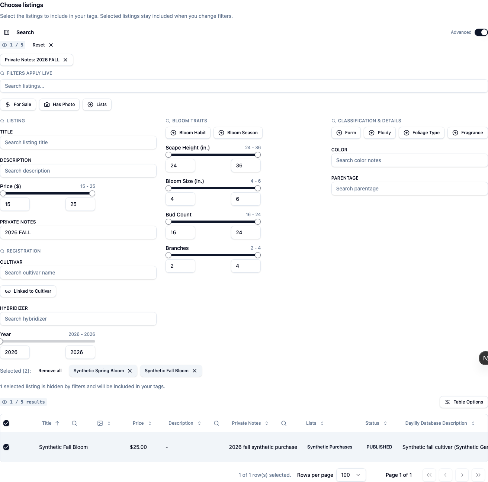

# Tags search verification

Tags now uses the app's shared Basic/Advanced search controls. Advanced
Listing filters include **Private Notes**. Text matching uses the existing
case-insensitive, normalized contains filter. Basic search, lists, price,
photos, and cultivar filters use the same columns and controls as Listings.

Selections stay selected when filters hide them. The page reports how many
selected listings are hidden. Preview and exports use the full selected set.
The table header selects only the visible page. **Reset** clears filters.
**Remove all** clears selection.

Tags filters and selection stay in page memory. Reload or leaving the route
clears them. Search mode and collapsed state retain their own Tags preferences.
Filter typing creates no URL parameters or browser history entries. URL filter
parameters are not restored for Tags. Global search can contain private notes,
so all Tags filters use this rule. The Tags surface blocks PostHog autocapture
and masks Sentry replay text. The owner-scoped dashboard read model remains the
only data source. No server procedure or public API was changed.

## Synthetic browser evidence

All captures use disposable integration fixtures and mock local providers.
No member database, printer, or outbound email service was used.

| View    | Before                                            | After with private-note filter                  |
| ------- | ------------------------------------------------- | ----------------------------------------------- |
| Desktop | [Before](evidence/tags-search/desktop-before.png) | [After](evidence/tags-search/desktop-after.png) |
| Phone   | [Before](evidence/tags-search/mobile-before.png)  | [After](evidence/tags-search/mobile-after.png)  |

The before captures restore the Tags component from base `e31a2cc3` and use
these same populated synthetic cultivar fixtures. The after captures show two selected listings. The `2026 FALL` filter displays
one matching listing. Both selected listings remain in preview and exports.

Run the focused browser flow from the repository root:

```sh
INTEGRATION_PORT=3240 TAGS_EVIDENCE_DIR=/tmp/tags-evidence \
  node apps/main/scripts/run-integration-local.mjs tags-search.integration.ts
```

The script provisions and removes its own database. Choose an unused port.
The flow runs at 1440×1000, 390×844, and 1024×1366 with touch enabled for the
phone and iPad sizes. It checks filter combinations, Basic/Advanced switching,
clear/reset, selection through no results, keyboard controls, navigation,
private text remaining local, and CSV/HTML/PDF/ZIP downloads. Another flow checks
loading, load failure, and recovery after refresh. Unit coverage checks loading
versus an empty account and URL synchronization opt-out.

## Screenshot review correction

The first desktop evidence had an empty **Bloom Traits** column and no
classification facets. Its fixtures had no bloom habit, season, size, height,
bud count, branches, form, ploidy, foliage, or fragrance. Shared Listings/member
controls omit options and ranges when the user's data has no values. That
capture did not demonstrate the requested controls, and the initial tests did
not catch the omission.

The replacement fixtures link two listings to synthetic V2 cultivar records
with all ten fields. They exercise the actual owner-scoped read model. The
browser tests now require each rendered control on desktop, phone, and iPad,
check both bloom-habit options, then select a facet and change a numeric range.
They assert result counts and retained hidden selections. A private-note
filter must leave all trait controls available. No further product source
change was needed after the populated-data comparison.

[Desktop filters](evidence/tags-search/desktop-filters.png) ·
[Phone filters](evidence/tags-search/mobile-filters.png) ·
[iPad filters](evidence/tags-search/ipad-filters.png) ·
[iPad full page](evidence/tags-search/ipad-after.png)



The browser comparison checks the same ten shared controls on
[Tags](evidence/tags-search/reference-tags-desktop.png),
[Listings](evidence/tags-search/reference-listings-desktop.png), and
[member search](evidence/tags-search/reference-member-desktop.png).
[Global Cultivar search](evidence/tags-search/reference-cultivars-desktop.png)
uses the same facet/range primitives with registration-wide ranges and extra
award, rebloom, flower-show, and sculpted-type filters. Tags follows the existing
Listings definitions, with Private Notes added, and retains the flat layout.

Cultivar search is disabled in the default integration runtime. For the
four-page comparison, set `TAGS_COMPARE_CULTIVAR_SEARCH=1` and point
`RUNTIME_FEATURE_FLAGS_PATH` to a temporary JSON file containing
`{"publicCultivarSearch":true}`. The fixture builds and removes its own search
candidate from the disposable database in this checkout. The normal CI run
compares Tags, Listings, and member search without changing runtime flags.

## Validation

- Typecheck passed.
- Full lint passed with repository design warnings. Changed source files passed without warnings.
- Full Vitest run: 203 files, 799 tests passed with four workers. An initial default-worker run timed out in the existing shadcn lint test. Its focused retry and the full repeat passed.
- Updated Chromium browser flows: five tests passed, including all four reference pages and desktop, phone, and iPad-sized touch screens.
- Previous implementation head: full Chromium integration suite passed. The updated fixture/regression head is checked separately in the PR checks.
- Updated WebKit browser flows: five tests passed, including populated facets, ranges, retained exports, and loading/error recovery. The comparison checks Tags, Listings, and member search. Back waits for the Dashboard to load before leaving. No errors are excluded from the assertion.

These checks verify simulated viewports and local provider boundaries. They do
not verify a physical iPad, Brother hardware, or production provider services.
